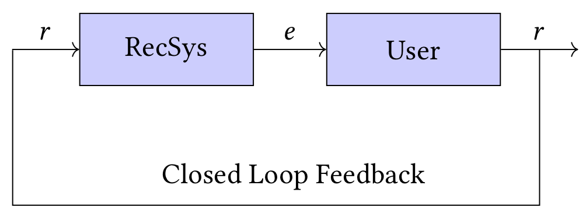

# The Simpson's Paradox in the Offline Evaluation of Recommendation Systems


Recommendation systems are often evaluated based on user’s interactions that were collected from an existing deployed system (see the above figure [Jadidinejad et al.](https://doi.org/10.1145/3397271.3401230)). Users only provide feedback (r) on those items they were exposed to by the deployed system (e). Hence, the collected feedback dataset used to evaluate a new model is influenced by the deployed system (RecSys), as a form of closed loop feedback. We show that the typical offline evaluation of recommenders suffers from the so-called Simpson’s paradox, which is a phenomenon observed when a significant trend appears in several different sub-populations of observational data but that disappears or reverses when these sub-populations are combined together. Our experiments based on stratified sampling reveal that a very small minority of items that are frequently exposed by the system plays a confounding factor in the offline evaluation of recommendations. We propose a novel evaluation methodology that takes into account the confounder, i.e. the deployed system’s characteristics.


## Structure
The following folders extends different parts of the [Cornac framework](https://github.com/PreferredAI/cornac):
* `eval_methods`: contains `stratified_evaluation.py` which is the implementation of the proposed propensity-based stratified evaluation method.
* `experiment`: contains `experiment.py` and `result.py` which is the representation of the stratified evaluation method.
* `dataset`: contains two files (`yahoo_music.py` and `coats.py`) to load the Yahoo! and Coat datasets.
* `data`: contains different data files including `exp_open_[dataset].pkl` and `exp_stra_[dataset].pkl` which stores all the results. You can load these files to reproduce the results instead of learning all 104 models.

Notebooks are available to reproduce the results on [MovieLens](experiments_ml.ipynb), [Yahoo!](experiments_yahoo.ipynb) and [Coat](experiments_coat.ipynb) datasets.

See [the paper](#) for more details.


## How to cite?
Use the corresponding bibtex entry to cite the paper:

```
@InProceedings{simpson_recsys20,
  author    = {Amir H. Jadidinejad and Craig Macdonald and Iadh Ounis},
  title     = {The Simpson's Paradox in the Offline Evaluation of Recommendation Systems},
  year      = {2020},
}
```
